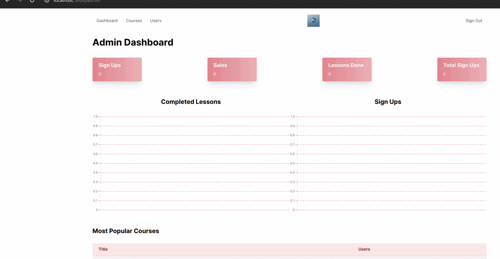

# Learning Platform 🎓

Welcome to our comprehensive learning platform - a robust Rails application designed to deliver an engaging educational experience for both students and educators.



## 📋 Project Description

The Learning Platform is a modern, full-featured educational system that enables:
- Seamless course delivery and consumption
- Interactive lesson management
- Secure user authentication
- Flexible content administration
- Integrated payment processing


## ⚙️ System Requirements

* Ruby 3.2.2
* PostgreSQL 12+
* Node.js 14+
* Yarn 1.22+

## 🚀 Quick Start Guide

### Initial Setup

1. Clone the repository:
   ```bash
   git clone [repo url]
   cd LearnWave
   ```

2. Install dependencies:
   ```bash
   bundle install
   yarn install
   ```

3. Configure environment:
   ```bash
   cp .env.example .env
   # Edit .env with your configuration
   ```

4. Setup database:
   ```bash
   rails db:create
   rails db:migrate
   rails db:seed  # Optional: Adds sample data
   ```

### Running the Application

1. Start the development server:
   ```bash
   rails server
   ```

2. Access the application at http://localhost:3000

## 🎯 Key Features

### For Students
* Intuitive course browsing and enrollment
* Progress tracking across courses
* Interactive lesson completion
* Secure payment processing
* Mobile-responsive design


### For Instructors
* Comprehensive course management
* Dynamic lesson creation and sequencing
* Rich content editor with media support
* Student progress monitoring
* Revenue tracking


### For Administrators
* User management system
* Content moderation tools
* Analytics dashboard
* System configuration controls
* Payment gateway integration


## 🔧 Development

### Running Tests

```bash
rails test                 # Run all tests
rails test:system         # Run system tests
rails test:controllers    # Run controller tests
```

### API Documentation

#### User Routes
- `GET /courses` - Browse available courses
- `GET /courses/:id` - View course details
- `GET /lessons/:id` - Access lesson content
- `POST /enrollments` - Enroll in a course

#### Admin Routes
- `GET /admin` - Access admin dashboard
- `GET /admin/courses` - Manage course catalog
- `GET /admin/courses/:id/lessons` - Organize course lessons
- `PATCH /admin/courses/:course_id/lessons/:id/move` - Adjust lesson sequence

## Deployment

This application is configured for deployment on Render.com using the included render.yaml configuration file.